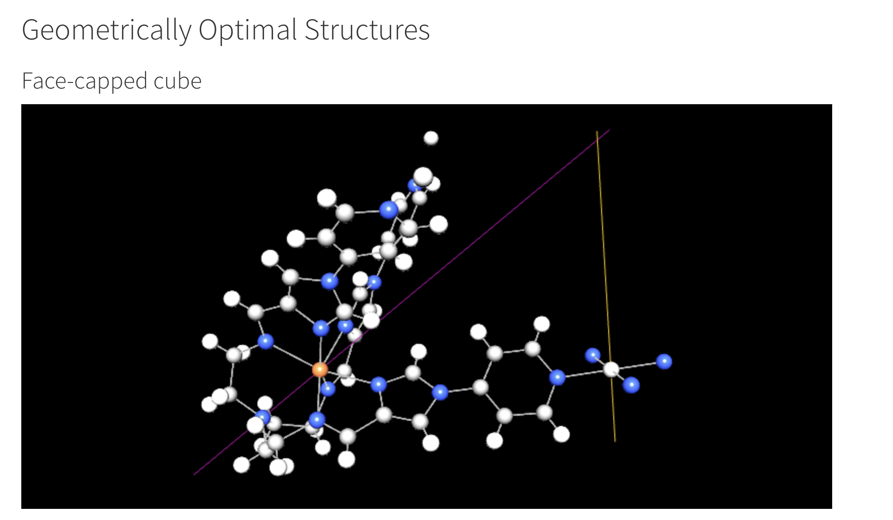

<!-- README.md is generated from README.Rmd. Please edit that file -->

# symbo 

<!-- badges: start -->

[](https://lifecycle.r-lib.org/articles/stages.html#experimental)
[](https://CRAN.R-project.org/package=symbo)

<!-- badges: end -->

> \[!WARNING\]  
> This package is in early development and not yet ready for use

symbo takes two molecular structures and assesses (based on their
symmetry properties) the geometric feasability of forming different
higher-order structures (e.g. tetrahedral / edge-capped cube /
face-capped cube / etc.)




## Installation

You can install the development version of symbo like so:

``` r
if (!require("remotes"))
    install.packages("remotes")

remotes::install_github("selkamand/symbo")
```

## Getting Started

Please see manual.
